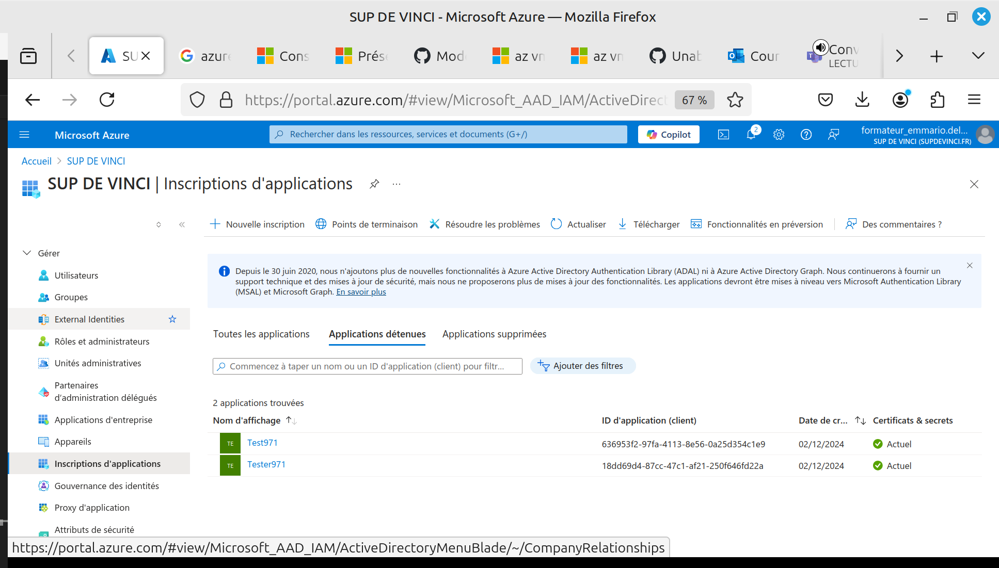
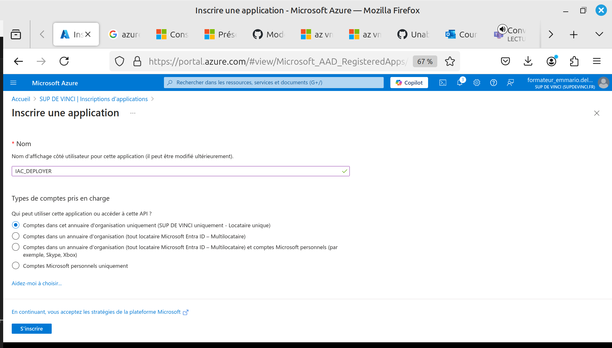
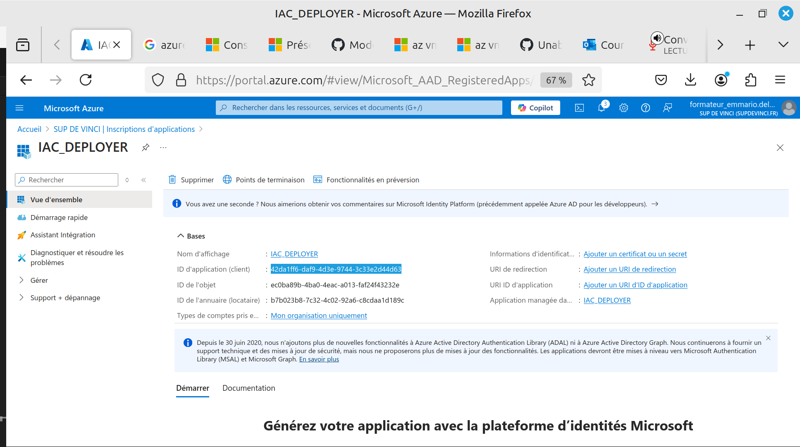
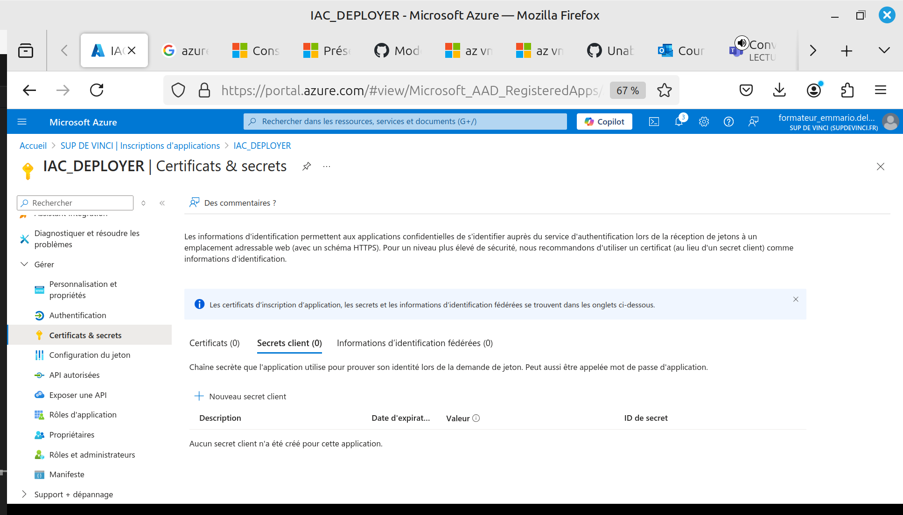
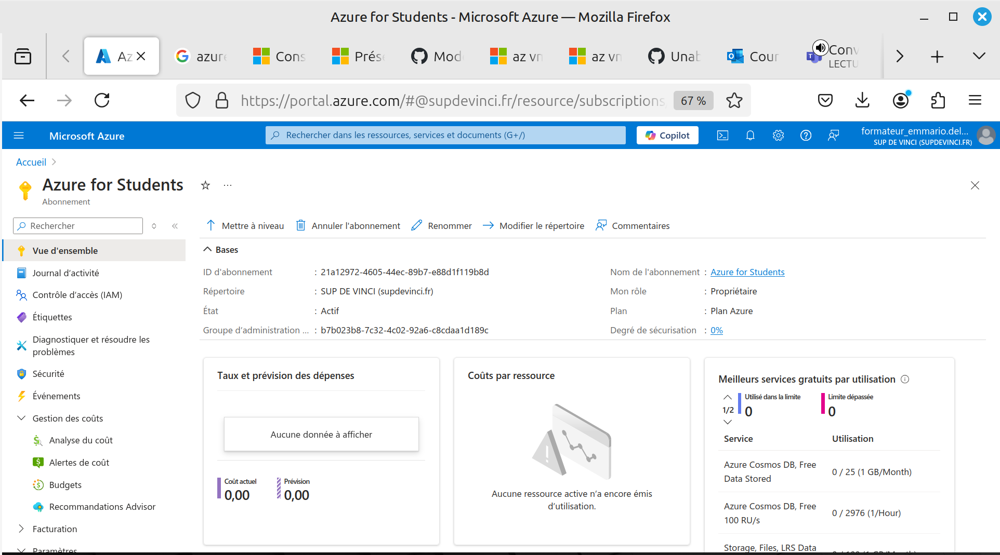
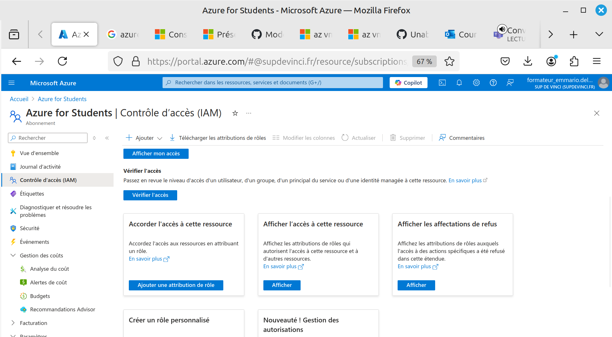
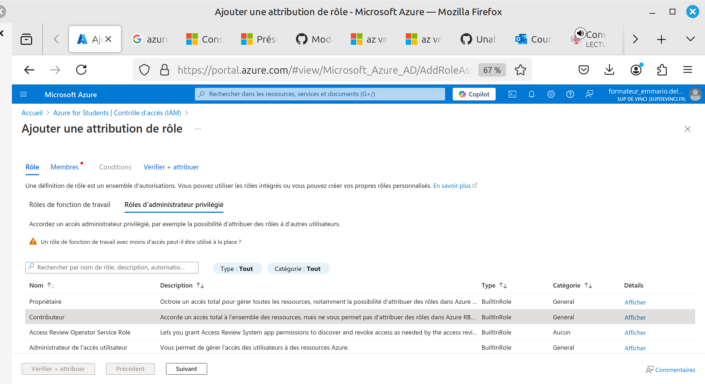
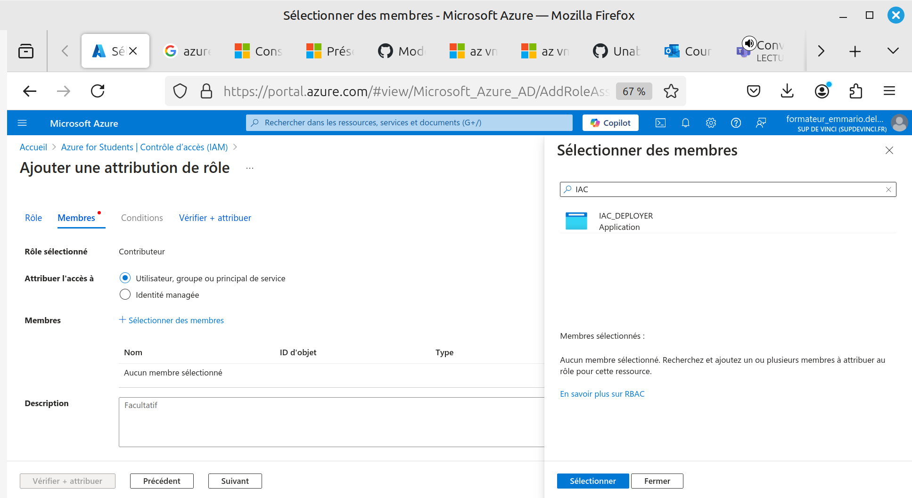
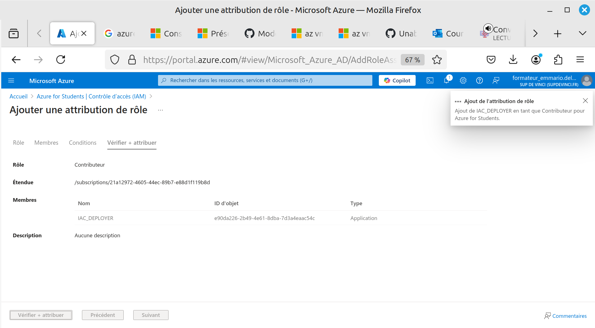

# Enregistrer une Application sur Azure pour vos Déploiements d'Infrastructure as Code

## Introduction

L'enregistrement d'une application sur Azure pour vos déploiements d'infrastructure as code est une pratique recommandée. Elle vous permet d'utiliser des identifiants sécurisés et automatisés, offrant une gestion des accès plus flexible et sécurisée que l'utilisation d'un compte utilisateur classique avec mot de passe.

## Étapes d'Enregistrement de l'Application

### 1. Accéder à Microsoft Entra ID

-   Dans la barre de recherche Azure, tapez : Microsoft Entra ID.
-   Cliquez sur Gérer, puis sur Inscriptions d'application.



### 2. Créer une Nouvelle Application

-   Sous votre répertoire, cliquez sur Nouvelle inscription d'application.
-   Donnez un nom à votre application, par exemple : `IAC_DEPLOYER`.
-   Laissez les autres paramètres par défaut et cliquez sur "Enregistrer".



### 3. Récupérer le `Client ID`

-   Une fois l'application créée, vous serez redirigé vers la page d'informations de l'application.
-   Notez le `client_id`, qui correspond au `<username>` de votre application.



## Configuration des Secrets

### 4. Ajouter un Secret

-   Dans le menu de gauche, sous l'onglet Gérer, sélectionnez Certificats et secrets.
-   Cliquez sur Nouveau secret client pour générer un secret.
-   Copiez la valeur du secret généré (assurez-vous de le faire immédiatement, car elle ne sera plus visible par la suite).



## Connexion et Configuration des Droits

### 5. Associer un Abonnement à votre Application

Avant de vous connecter en tant qu'application, connectez-vous avec un compte utilisateur et liez votre abonnement à l'application :

```bash
az login --username <user> --password <pass>
az ad sp create-for-rbac --name <name_app> --role Owner --scopes /subscriptions/<subscription_id>

```

### 6. Connexion en tant qu'Application

Utilisez les informations de votre application pour vous connecter via Azure CLI :

```bash
az login --service-principal --username <app_id> --password <app_secret> --tenant <tenant>

```




## Gestion des Rôles et Droits

### 7. Attribuer des Rôles à l'Application

-   Accédez à IAM (Contrôle d'accès).
-   Cliquez sur Ajouter une attribution de rôle.



#### Sélection d'un Rôle

-   Dans la liste des rôles, sélectionnez celui que vous souhaitez attribuer à l'application.
-   Exemple : un rôle d'administrateur privilégié.



#### Sélection de l'Application

-   Cliquez sur "Suivant".
-   Dans l'onglet "Membres", sélectionnez "Sélectionner des membres".
-   Choisissez votre application.



### 8. Vérification des Droits

Une fois le rôle ajouté, votre application disposera des permissions correspondantes au rôle attribué. Ces permissions peuvent être ajustées et combinées avec plusieurs rôles.


